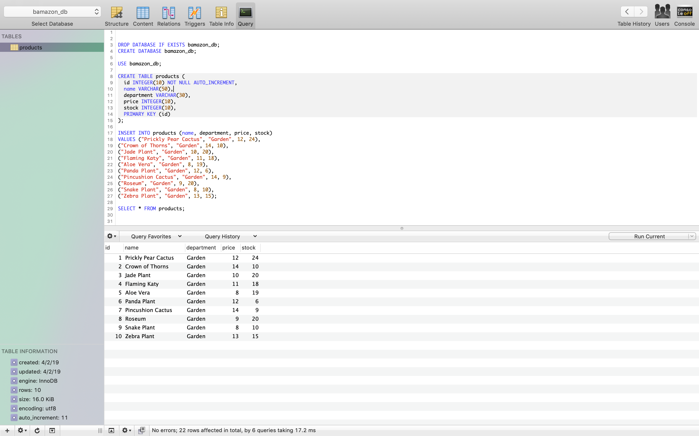
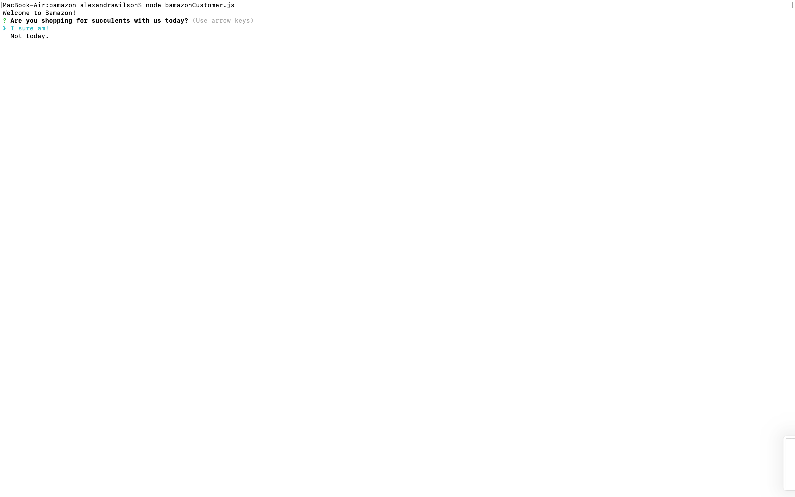
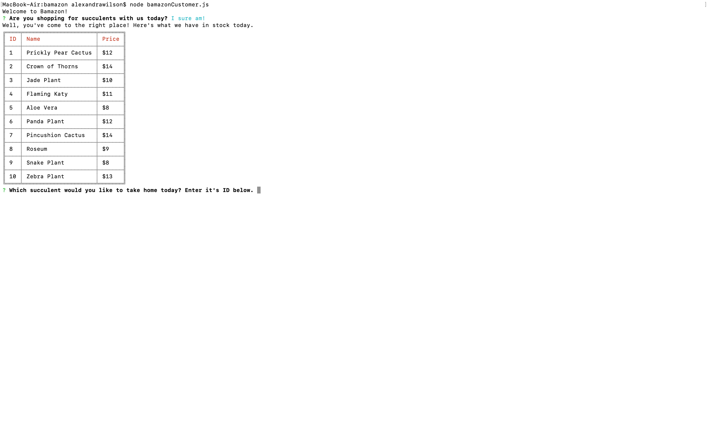
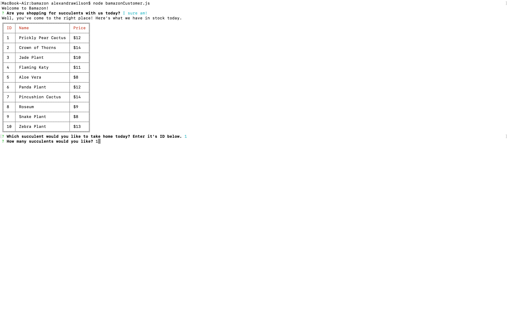
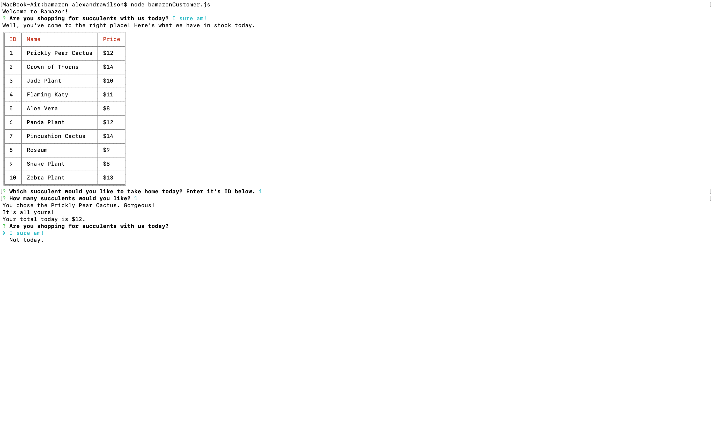
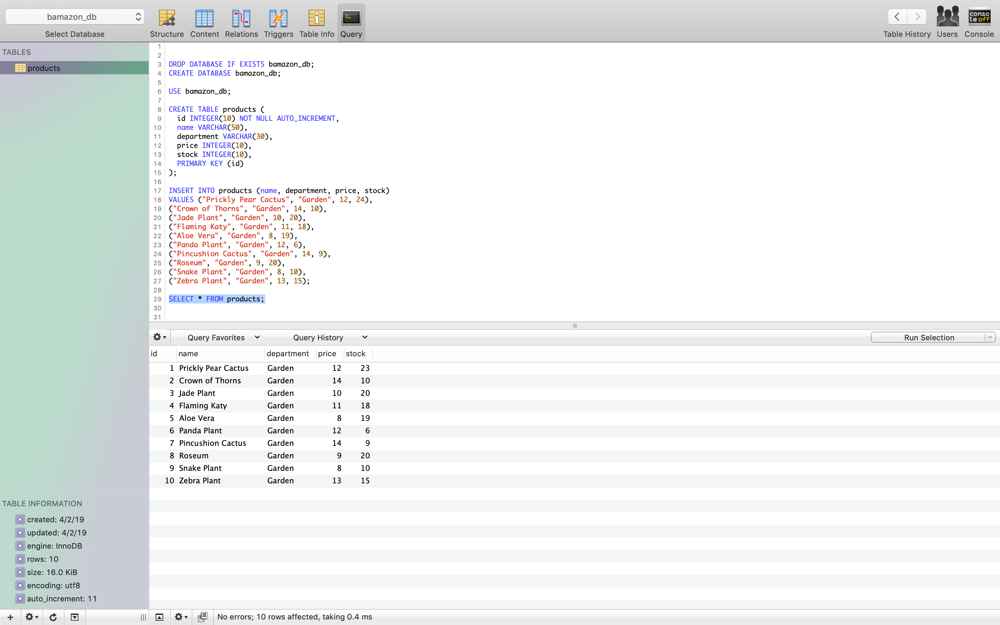
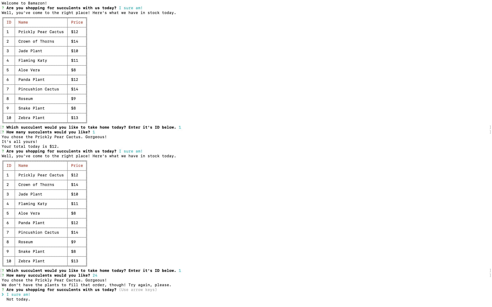
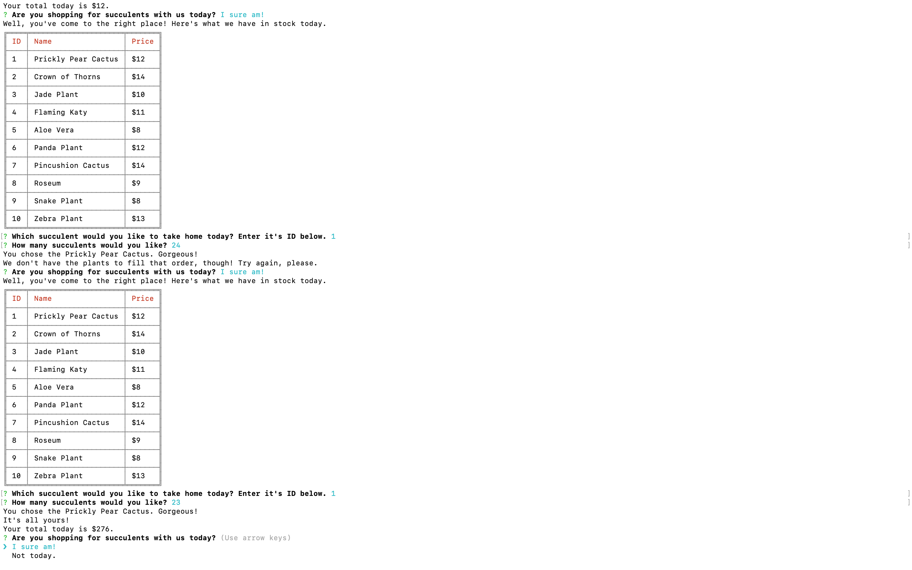
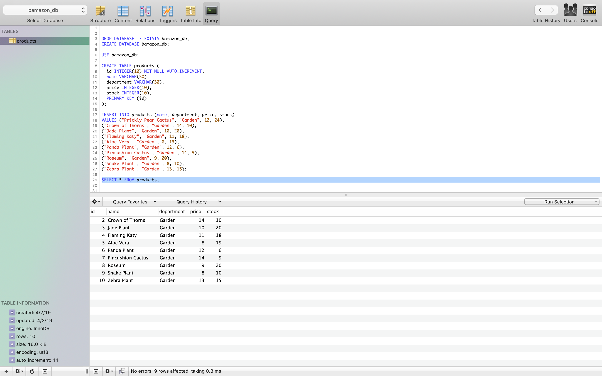
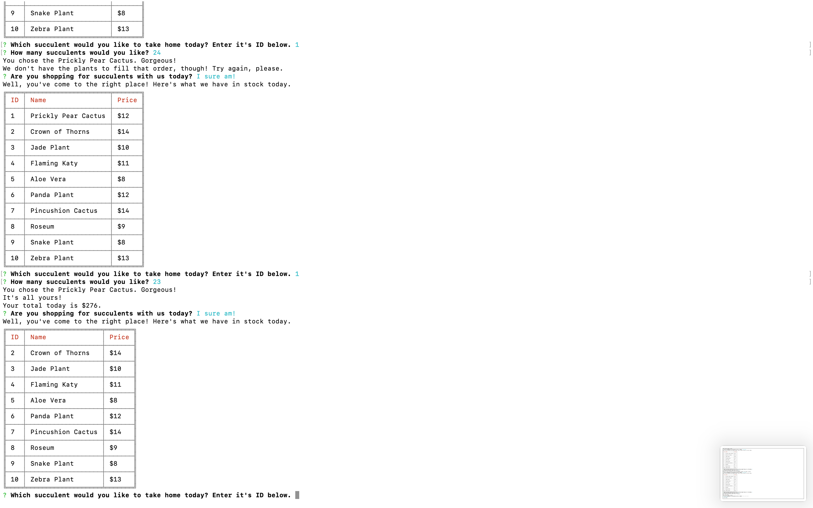

# bamazon

Welcome to Bamazon!

Bamazon is a CLI app that uses Node.js and MySQL to replicate the experience of online shopping. For this project, I created a succulent store where you can view and purchase inventory. After you've made your purchase, your total is displayed, inventory is updated, out of stock items are removed from the list of available options and you're invited to continue shopping, or exit the program. Check out the screenshots below to follow along with the experience!

Here's a view of the initial state of the MySQL Database:
***

***

Open the command line, navigate to the bamazon folder and enter  node bamazonCustomer.js  to start the program.
***

***

***

Let's start shopping.
***

***

Bamazon prompts you to choose a plant by ID and specify how many you'd like.
***

***

Once you've answer the prompts, Bamazon repeats your choice and if you've chosen a plant with enough inventory to fill your order, you will see your total and the program will give you the option to continue shopping.
***

***

As you can see, the stock in the database will decrease by the number of plants you have purchased. Here, the Prickly Pear stock has gone down by 1.
***

***

If you attempt to purchase more plants than we have in stock, Bamazon will alert you that we can't fulfill the order and prompt you to choose again.
***

***

If you purchase exactly as many as we have in stock, the order goes through normally.
***

***

But subsequently, the item is removed from the database,
***

***
which ensures that the plant won't be available for purchase later on. Here you can see the plant has been removed from the list of options.
***

***

Should you decide you're all finished shopping, Bamazon will bid you farewell.
***

***

